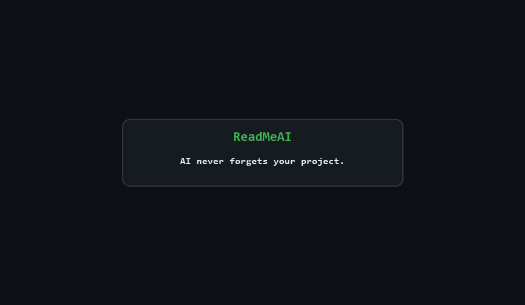

<div align="center">


# ReadMeAI

**AI coding tools are context-blind. This fixes it.**

One file. Reads itself at session start. Updates itself at session end. Works with every AI tool.

[](https://github.com/Oscarr36/ReadMeAI/stargazers)
[](https://github.com/Oscarr36/ReadMeAI/forks)
[](.readmeAI)
[](AGENTS.md)
[](https://github.com/Oscarr36/ReadMeAI/actions/workflows/readmeai-validate.yml)
[](LICENSE)
[](CONTRIBUTING.md)

**Works with:** Claude Code · Cursor · Windsurf · GitHub Copilot · Antigravity CLI · Codex CLI · OpenCode · Kilo Code · Aider · Continue · Zed · any tool that reads AGENTS.md

</div>

---

```bash
# macOS / Linux
curl -sSL https://raw.githubusercontent.com/Oscarr36/ReadMeAI/main/setup.sh | bash

# Windows PowerShell
irm https://raw.githubusercontent.com/Oscarr36/ReadMeAI/main/setup.ps1 | iex
```

That's it. The script downloads `.readmeAI`, scans your project, and wires the right integration file for every AI tool it detects.

---

## The problem

You open your AI coding tool. Session starts. The AI has forgotten everything.

**It doesn't know:**
- What you built last week
- The domain rule that causes a subtle bug when ignored
- The architectural decision you made three sessions ago and why
- Where the codebase is going and where it currently sits

You explain it again. 8 messages. 10 minutes. Same conversation you had before.

**This happens every single session.**

---

## The solution

`.readmeAI` is a structured project context file that:

1. **Auto-reads at session start** — no prompt, no reminder, before the AI types anything
2. **Captures what the code doesn't say** — domain rules, gotchas, architectural decisions, work in progress
3. **Updates silently at session end** — session state, decisions, symbol index
4. **Works with every AI tool** — generates AGENTS.md (universal), CLAUDE.md, .cursorrules, .windsurfrules, GEMINI.md (Antigravity CLI), and more

**The result:** "Continue where we left off" actually works. Every time.

---

## What gets wired automatically

Run the setup script once. It detects every AI tool you have and creates the right file:

| Created file | Read by | Token cost |
|-------------|---------|-----------|
| `AGENTS.md` | Cursor, Windsurf, Copilot agent, Codex CLI, OpenCode, Kilo Code, Amp, 40+ tools | once per session |
| `GEMINI.md` | Antigravity CLI (`agy`) — formerly Gemini CLI | once per session |
| `.claude/CLAUDE.md` | Claude Code | once per session |
| `.cursor/rules/*.mdc` | Cursor (modern, scoped) | JIT — only when relevant |
| `.cursorrules` | Cursor (legacy) | once per session |
| `.windsurfrules` | Windsurf | once per session |
| `.github/copilot-instructions.md` | GitHub Copilot | once per session |
| `.aider.conf.yml` | Aider | every run |
| `.continue/rules/readmeai.md` | Continue | once per session |
| `.rules` | Zed (`@rules` mention) | on-demand |

**Cursor gets 3 scoped .mdc files** — `readmeai-context.mdc` (always), `readmeai-security.mdc` (auto-loads on auth files), `readmeai-conventions.mdc` (on-demand). JIT loading: context only when needed.

---

## What's inside `.readmeAI`

Lean by default (~300 lines). Every section earns its place:

```
⚡  QUICK REFERENCE   — 5 lines. Hot restart in <50 tokens.
⚙️  AI PROTOCOL       — when to read what, session start/end rules
📋  PROJECT IDENTITY  — stack, commands, repo
🧠  DOMAIN RULES      — rules that cause bugs when unknown (highest value)
🏗  STRUCTURE MAP     — annotated file tree — replaces filesystem scanning
🔍  SYMBOL INDEX      — key symbols with purpose — no stale line numbers
📐  CONVENTIONS       — naming, git, comments — enforced on all output
✅  CODE QUALITY      — pre-output checklist + forbidden patterns (mandatory)
🎯  SESSION STATE     — hot-restart point: objective, last action, next step
📚  DECISIONS LOG     — architecture choices with rationale (append-only)
✅  PROGRESS          — in-progress, backlog, completed
🐛  KNOWN ISSUES      — bugs and tech debt
🗒  AI NOTES          — gotchas, surprises [!] [~] [?] severity tags
```

**Optional sections** (uncomment when needed — excluded by default to save tokens):
`🔐 SECURITY` · `🔌 API CONTRACTS` · `🧪 TESTING` · `⚡ PERFORMANCE` · `📦 DEPENDENCIES` · `🔧 ENVIRONMENT`

---

## What it looks like in practice

```
Day 1
  You: "Build user auth with JWT"
  AI:  reads .readmeAI → knows stack, structure, conventions
       builds auth following your exact architecture
       updates SESSION STATE, DECISIONS LOG silently at end

Day 2 (new session — AI has forgotten everything)
  You: "Continue where we left off"
  AI:  reads QUICK REFERENCE → reads SESSION STATE
       "Resuming: login done, writing signup handler"
       → opens exactly the right file
       → continues without a single re-explanation
```

---

## Setup commands

```bash
bash setup.sh                # download .readmeAI + auto-detect AI tools
bash setup.sh --all          # wire ALL AI tool integrations
bash setup.sh --detect       # also scan project and pre-fill TECH STACK + AI NOTES from git
bash setup.sh --validate     # check .readmeAI is in sync with the codebase
bash setup.sh --update       # refresh TECH STACK after adding dependencies
bash setup.sh --all --detect # everything at once
bash setup.sh --sync         # after each coding session: flags new files, new symbols, deleted refs
bash setup.sh --health       # score your .readmeAI quality [0-100] and find gaps
```

**Autonomous sync — no commands needed.** Setup installs a git `post-commit` hook that runs automatically after every `git commit`, in any editor. The hook auto-patches QUICK REFERENCE and flags gaps. Claude Code users also get a Stop hook that fires after every response.

`--detect` does real work:
- Reads `package.json` / `pyproject.toml` / `go.mod` / `Cargo.toml` / `Gemfile` — fills TECH STACK with real versions
- Scans git history (6 months) for high-churn files → flags them in AI NOTES as fragile areas
- Greps source for `IMPORTANT:` / `WARNING:` / `HACK:` / `DO NOT` comments → surfaces them in AI NOTES

---

## After setup

**First-time:** tell your AI:
> *"Detect my stack, fill what you can, ask me only for what you can't infer."*

**Every session after:**
> *"Continue where we left off."*

That's it. The AI reads `.readmeAI`, knows where it is, and continues.

---

## GitHub Actions

The setup generates `.github/workflows/readmeai-validate.yml`. On every push it checks:
- `.readmeAI` exists and is filled (not blank template)
- `AGENTS.md` is present for cross-tool compatibility
- DOMAIN RULES are not empty (highest-value section)
- QUICK REFERENCE is populated (enables hot restart)
- AI tool integrations are wired
- File isn't bloated (>800 lines triggers a warning)

---

## ReadMeAI vs alternatives

| | ReadMeAI | claude-mem | mem0 |
|--|--|--|--|
| **AI tools supported** | All (Cursor, Copilot, Windsurf, Antigravity, Codex CLI, Aider...) | Claude Code only | Claude Code only |
| **Setup** | `curl ... \| bash` | npm install + MCP | npm install + API key |
| **Storage** | Plain text file | SQLite + vector DB | Cloud API |
| **Dependencies** | None | Node.js + Chroma | Node.js + internet |
| **Domain rules** | Yes — you write rules that override AI | No | No |
| **Git-friendly** | Yes — commit it, diff it, review in PRs | No (binary DB) | No (cloud) |
| **Team sharing** | Yes — one file, whole team benefits | No (per-user local) | No (per-user) |
| **Works offline** | Yes | Yes | No |
| **Context budget** | ~200 active lines (~1.5k tokens) | AI-compressed, variable | AI-compressed |

**The key difference:** ReadMeAI is for what the AI *can't* figure out — domain rules, architectural decisions, business constraints. claude-mem captures what the AI *did*. Both are useful; they solve different problems.

---

## Design principles

| | |
|--|--|
| **Domain rules beat everything** | A rule in `.readmeAI` overrides AI training data. This is enforced explicitly. |
| **QUICK REFERENCE for hot restart** | 5-line table at the top. Resume in <50 tokens without reading the full file. |
| **Lean by default** | Optional sections excluded until you need them. No dead weight burning your context window. |
| **Append-only logs** | DECISIONS LOG and AI NOTES never get edited. History is permanent. |
| **No stale line numbers** | SYMBOL INDEX uses name + file + purpose. Refactoring doesn't break it. |
| **Git-aware** | `--detect` reads git history to find fragile files and surface important comments. |

---

## Roadmap

- [x] AGENTS.md universal standard support
- [x] GEMINI.md — supports Antigravity CLI (`agy`), backward-compatible with Gemini CLI
- [x] Cursor .mdc scoped rules (JIT loading)
- [x] `--detect` with git history scanning + comment extraction
- [x] GitHub Actions sync validation
- [x] QUICK REFERENCE for hot restarts
- [x] Codex CLI (OpenAI) — reads AGENTS.md natively, no extra file needed
- [x] `--sync` — post-session context sync: flags new files, symbols, stale refs from git diff
- [x] `--health` — quality score [0-100] with actionable gaps across 5 dimensions
- [x] Zed editor support via `.rules` file
- [x] Git `post-commit` hook — autonomous sync in **any** editor after every commit
- [x] OpenCode + Kilo Code documented as supported via AGENTS.md
- [x] `setup.ps1` full Windows parity — `-Sync`, `-Health`, Antigravity CLI, Zed, autonomous hooks
- [ ] `readmeai` CLI (npm/pip install)
- [ ] VS Code extension — syntax highlighting + snippets
- [ ] Template variants — SPA · REST API · fullstack monorepo · CLI

---

## Using ReadMeAI in your project?

Add this badge:

```markdown
[](https://github.com/Oscarr36/ReadMeAI)
```

Renders as: [](https://github.com/Oscarr36/ReadMeAI)

---

## Demo



---

<div align="center">

If ReadMeAI saves you time, **[leave a star ⭐](https://github.com/Oscarr36/ReadMeAI/stargazers)**

[MIT License](LICENSE) — use it, fork it, adapt it.

</div>
