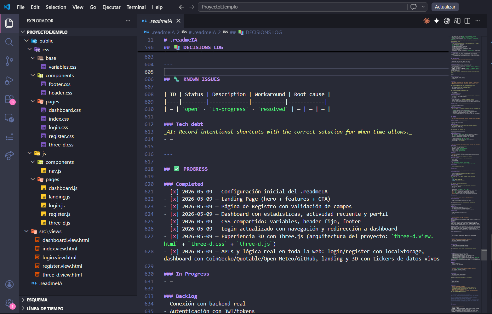

<div align="center">


<p><strong>A self-updating AI context file that keeps every session fully oriented — no re-explaining, no context drift, no messy structure.</strong></p>

[](https://github.com/Oscarr36/ReadMeAI/stargazers)
[](https://github.com/Oscarr36/ReadMeAI/forks)
[](LICENSE)
[](.readmeAI)
[](CONTRIBUTING.md)
[](.readmeAI)

**Languages:** [English](README.md) · [Español](docs/README.es.md) · [Português](docs/README.pt.md) · [Français](docs/README.fr.md)

**Works with:** Claude · ChatGPT · GitHub Copilot · Gemini · Cursor · any AI assistant

---

### ↓ Get it in one command

```bash
# bash / mac / linux
curl -o .readmeAI https://raw.githubusercontent.com/Oscarr36/ReadMeAI/main/.readmeAI
```

```powershell
# PowerShell / Windows
Invoke-WebRequest -Uri "https://raw.githubusercontent.com/Oscarr36/ReadMeAI/main/.readmeAI" -OutFile ".readmeAI"
```

</div>

---

## The problem

You start a project with an AI assistant. It goes well. You close the session.

**Next day:** the AI has no idea what you built, what decisions you made, what conventions you agreed on, or where you left off. You spend 10 minutes re-explaining everything. CSS ends up inside HTML templates. Business logic leaks into route handlers. Config is hardcoded. The project becomes a mess.

The AI is powerful. **The problem is context — it resets.**

---

## The solution

Drop a `.readmeAI` file at the root of any project. One file the AI reads completely before doing anything, and updates silently after every session.

| Without ReadMeAI | With ReadMeAI |
|-----------------|--------------|
| Must say "Read the context" every session | AI auto-reads at session start — no prompt needed |
| Re-explain architecture every session | AI loads full context in seconds |
| AI invents its own structure | Enforced folder rules, every time |
| Inconsistent naming and style | Conventions locked and applied |
| Lost decisions and history | Decisions log grows automatically |
| "Where did we leave off?" | AI resumes from the exact last step |
| AI reads every file to find things | Symbol index → direct file:line jumps |

---

## What's inside the template

The `.readmeAI` file is organized into **24 sections**, each maintained automatically by the AI:

```
⚙️  AI PROTOCOL          — session rules, token efficiency, quality gate
🧭  PROJECT CONTEXT       — purpose, goals, constraints, domain rules
🧠  SKILLS & ECOSYSTEM    — auto-detect tech stack, assemble structure & rules
📋  PROJECT IDENTITY      — name, version, phase, type, repo
🛠  TECH STACK            — every layer with versions
🏗  STRUCTURE MAP         — full annotated file tree (replaces filesystem scanning)
🔍  SYMBOL INDEX          — every key function/class at exact file:line
📐  CONVENTIONS           — file naming, CSS, JS, git, comments policy
✅  CODE QUALITY          — pre-output checklist, naming semantics, forbidden patterns
🔌  API & DATA CONTRACTS  — endpoints, external APIs, data models, env vars
🔐  SECURITY              — auth model, sensitive data, attack surface, hard blocks
⚡  PERFORMANCE           — SLAs, bottlenecks, caching strategy, DB rules
🧪  TESTING STRATEGY      — coverage map, mock rules, fixtures, CI requirements
🚨  ERROR HANDLING        — propagation model, response format, logging rules
📦  DEPENDENCIES          — critical packages, conflicts, update policy, banned list
🎯  CURRENT SESSION STATE — live snapshot: objective, last action, next step
📚  DECISIONS LOG         — every architectural decision with rationale
🐛  KNOWN ISSUES          — bugs, workarounds, tech debt
✅  PROGRESS              — completed, in-progress, backlog
🔗  CROSS-PROJECT REFS    — links to sibling projects
🔧  ENVIRONMENT           — tools, setup sequence, common commands
🗒  AI NOTES              — free-form scratchpad for non-obvious observations
📜  CHANGE LOG            — session-by-session history
```

---

## How it works

```
Session 1:
  You → "Let's build a user auth system"
  AI  → auto-reads .readmeAI at session start, loads context,
        structure, conventions, security rules
  AI  → builds auth following the exact architecture defined
  AI  → updates change log, progress, session state — silently

Session 2 (days later):
  You → "Continue where we left off"
  AI  → auto-reads .readmeAI → full context restored instantly
  AI  → opens auth file directly at the right line (symbol index)
  AI  → continues without a single re-explanation
```

> The file grows with the project. The more sessions, the richer the context.

---

## Demo


---

## Preview

> What `.readmeAI` looks like inside a real project (VS Code):



---

## Structure enforced

The AI enforces strict separation of concerns. Every directory has explicit rules for what it **owns** and what it **must not contain**:

```
project/
├── .readmeAI               ← AI context. Never move. Never delete.
├── config/                 ← All config. Never in src/.
├── src/
│   ├── controllers/        ← Business logic only. No DB queries.
│   ├── models/             ← Data schemas + DB queries. No HTTP.
│   ├── views/              ← Templates. No inline styles or logic.
│   ├── routes/             ← Route definitions only. Delegate to controllers.
│   ├── middleware/         ← Auth, validation, logging.
│   └── services/           ← External APIs, shared utilities.
├── public/
│   ├── css/                ← All stylesheets. Never in views.
│   ├── js/                 ← Client-side only. Never mixed with server.
│   └── assets/
└── tests/
    ├── unit/               ← Mirrors src/ structure.
    └── integration/
```

Any file placed outside this structure is flagged immediately.

---

## Code quality built in

Every code output is checked against a built-in checklist before delivery:

- Single responsibility per function
- No nesting deeper than 3 levels
- No hardcoded values — constants or config always
- Semantic naming enforced (functions = verbs, booleans = `is/has/can`, etc.)
- Forbidden patterns blocked: `eval`, raw SQL, empty catch blocks, secrets in code
- Consistency rule: if a pattern exists in the codebase, match it exactly

---

## Token efficiency

The **Symbol Index** is the core token-saving feature. Instead of scanning the project each session, the AI records every key symbol at its exact `file:line`:

```
Need to modify the login flow?
→ Look up "login" in Symbol Index
→ Read src/auth/login.js:23-67 only
→ Done. No glob. No scan.
```

After the first setup, the AI never re-reads the whole project.

---

## Quickstart

**1. Copy the template to your project root**
```bash
curl -o .readmeAI https://raw.githubusercontent.com/Oscarr36/ReadMeAI/main/.readmeAI
```

**2. Tell your AI to set it up** *(do this once)*
> "Detect my project skills, assemble the ecosystem, fill in everything you can infer, then ask me only for what you can't."

> The AI will automatically detect your tech stack (React, Django, Express, etc.) and configure the right project structure, conventions, security rules, and tooling — no manual setup needed.

**3. Start building**
> "Let's [task]."

**4. Resume any time**
> "Continue where we left off."

> **Note:** You don't need to say "Read the .readmeAI" — the AI is instructed to read it automatically at the start of every session. Just tell it what to do.

The AI reads the file silently at session start and updates it at the end. You never need to ask.

---

## Recommended start prompts

> The AI reads `.readmeAI` automatically at session start. You never need to say "Read the .readmeAI".

```
First setup:
"Detect my project skills, assemble the ecosystem, fill in
everything you can infer, then ask me only for what you can't."

Every other session:
"Continue where we left off."

Specific task:
"[Task]. Follow the architecture, conventions, and quality
rules defined in the project context."

Ecosystem review:
"Check the SKILLS & ECOSYSTEM section. Do the detected skills
match the project? Are any missing?"
```

---

## Multi-project workspaces

Each project gets its own `.readmeAI`. Cross-reference related projects and the AI reads all of them before answering cross-project questions:

```markdown
## 🔗 CROSS-PROJECT REFERENCES
| Alias  | Location      | Relationship                    |
|--------|---------------|---------------------------------|
| api    | ../my-api     | Backend for this frontend       |
| shared | ../shared-lib | Shared components + utilities   |
```

---

## Design principles

| Principle | What it means |
|-----------|--------------|
| **One file, complete context** | No scattered docs, no wikis, no Notion. One file the AI always finds. |
| **Append, never delete** | History is permanent. The file only grows. |
| **Structure before code** | Conventions defined upfront. The AI enforces them, not you. |
| **Reality over documentation** | Code contradicts the file? Update the file. The codebase is always the source of truth. |
| **Zero human dependency** | A cold AI reading this file alone must be able to continue without asking a single question. |
| **Token efficiency** | Symbol Index + Structure Map replace filesystem scanning entirely. |

---

## Roadmap

- [x] Skills & Ecosystem detection — auto-detect tech stack, assemble structure & rules
- [ ] `readmeia init` CLI — scaffold a project with the full structure in one command
- [ ] VS Code extension — syntax highlighting and snippets for `.readmeAI`
- [ ] Template variants — SPA, REST API, fullstack monorepo, CLI tool
- [ ] Workspace mode — read multiple `.readmeAI` files in one AI session
- [ ] Validation script — checks that the project structure matches the spec

---

## Using ReadMeAI in your project?

Add this badge to your README so others discover it:

```markdown
[](https://github.com/Oscarr36/ReadMeAI)
```

It renders as: [](https://github.com/Oscarr36/ReadMeAI)

---

## Contributing

This is an open specification. If you use it and improve it, open a PR.

Read [CONTRIBUTING.md](CONTRIBUTING.md) for guidelines.

---

<div align="center">

If ReadMeAI saves you time, **[leave a star](https://github.com/Oscarr36/ReadMeAI/stargazers)** — it helps others find it.

[MIT](LICENSE) — use it, fork it, adapt it.

</div>
